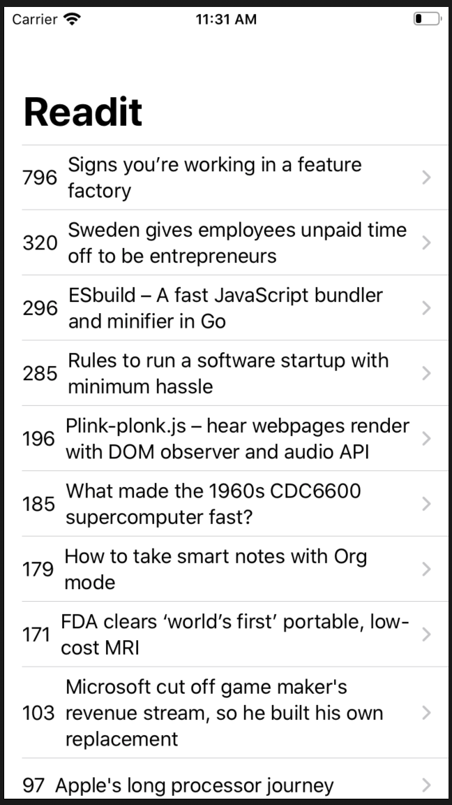
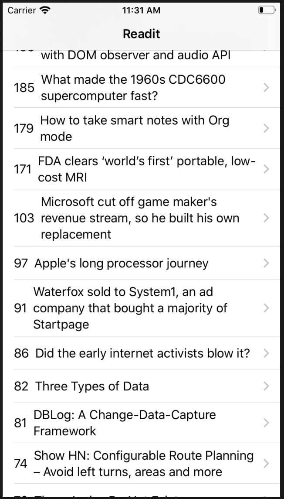
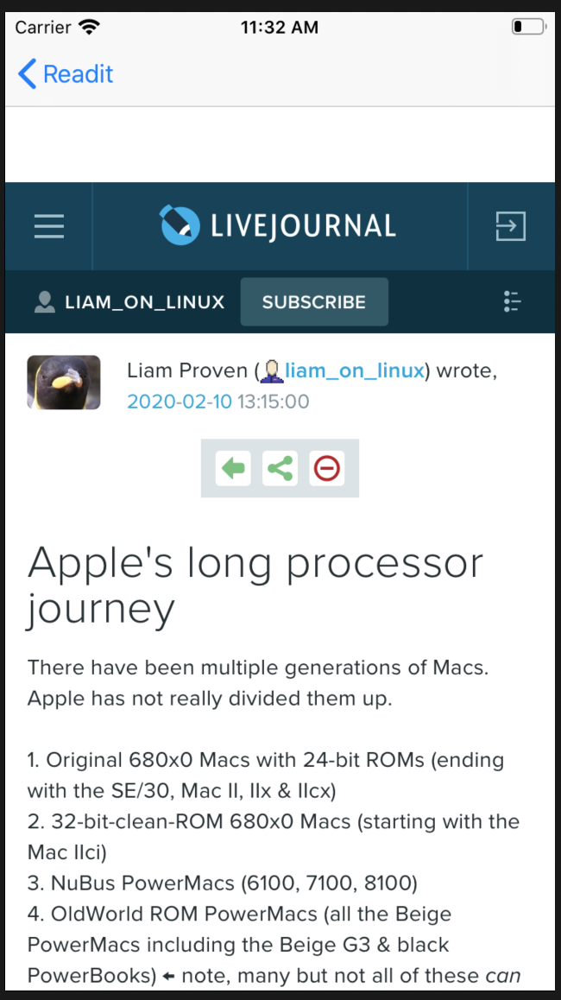
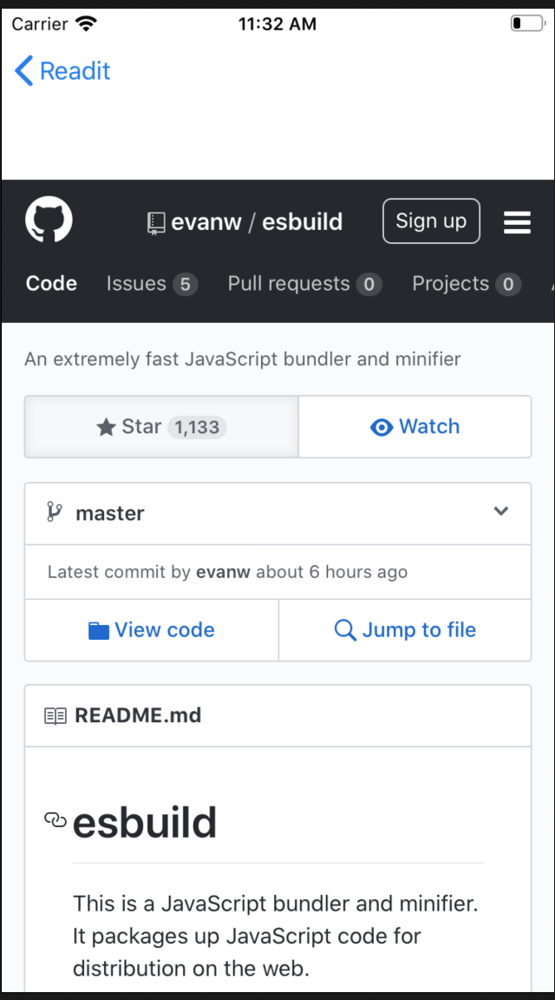

# Readit
An iOS Application to get latest news fetched from API (ycombinator)

# App Description
The Readit application allows users that to get an Latest news that is published on the news channel by HACKERNEWS and get an detailed view of a description by open browser to get full description of the article.

# Snapshots of Screen Boards

 

# Working 
open project and traverse to the corresponding directory and install all the pods from the pod file

workspace is created, then run the project 
